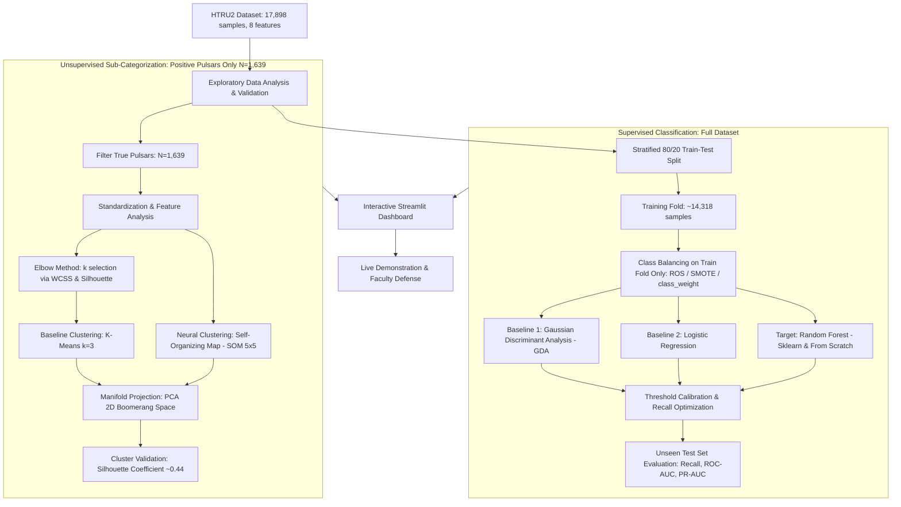

# Implementation Plan: Automated Identification and Sub-Categorization of Radio Pulsar Signal Candidates

## Course Context
- **Course**: UE24CS352A – Machine Learning Mini-Project
- **Weightage**: 10 Marks
- **Timeline**: 1-Week Intensive Mini-Project
- **Deliverables**: GitHub Repository + README, 2-Page Executive Summary (PDF), Slide Deck, and Live Interactive Code Demonstration

---

## 1. Executive Summary & Problem Formulation

### 1.1 Astrophysical Domain & Motivation
Pulsars are highly magnetized, rapidly rotating neutron stars born in supernova explosions. They emit beams of electromagnetic radiation from their magnetic poles. Due to rotation, these beams sweep across space like a cosmic lighthouse, producing periodic pulse trains detectable by Earth-based radio telescopes (such as the Parkes Observatory used in the High Time Resolution Universe Survey - HTRU-S).

Pulsars serve as natural cosmic laboratories for testing general relativity, detecting low-frequency gravitational waves, and probing the interstellar medium. However, modern wide-field surveys detect tens of millions of periodic candidate signals, where more than **90%** are caused by terrestrial Radio Frequency Interference (RFI) or background noise. Manual inspection is unscalable; automated machine learning classification is necessary.

### 1.2 Core Machine Learning Challenges
1. **Severe Class Imbalance**: In the benchmark HTRU2 dataset, real pulsars constitute only ~9.16% of all recorded candidates (~1:10 imbalance ratio). A trivial majority-class classifier achieves ~90.8% accuracy with zero predictive utility.
2. **Asymmetric Error Costs (Recall vs. Precision)**: In observational astrophysics, the penalty for a False Negative (discarding a true pulsar discovery) is drastically higher than vetting a False Positive. Hence, **Recall / Sensitivity** and **PR-AUC** are prioritized over raw classification accuracy.
3. **Sub-Categorization via Unsupervised Exploration**: Beyond binary classification, true pulsar candidates exhibit internal morphology variations. Identifying these clusters without ground-truth sub-labels requires unsupervised clustering and non-linear manifold analysis.

---

## 2. Dataset Specification (HTRU2)

- **Total Samples**: 17,898 instances
- **Target Distribution**:
  - **Negative (Class 0 - RFI / Noise)**: 16,259 instances (90.84%)
  - **Positive (Class 1 - Real Pulsars)**: 1,639 instances (9.16%)
- **File Format**: The CSV file (`HTRU_2.csv`) is **headerless** — all 17,898 rows are pure data with no column header line. It must be loaded with `header=None` and column names assigned manually, otherwise the first data row is silently consumed as column names.
- **Feature Set (8 Continuous Numerical Features)**:
  - *Folded Integrated Pulse Profile Statistics*:
    1. `mean_ip`: Mean of the integrated pulse profile
    2. `std_ip`: Standard deviation of the integrated pulse profile
    3. `kurtosis_ip`: Excess kurtosis of the integrated pulse profile
    4. `skewness_ip`: Skewness of the integrated pulse profile
  - *Dispersion Measure vs. Signal-to-Noise Ratio (DM-SNR) Curve Statistics*:
    5. `mean_snr`: Mean of the DM-SNR curve
    6. `std_snr`: Standard deviation of the DM-SNR curve
    7. `kurtosis_snr`: Excess kurtosis of the DM-SNR curve
    8. `skewness_snr`: Skewness of the DM-SNR curve
- **Citation**: R. J. Lyon, B. W. Stappers, S. Cooper, J. M. Brooke, J. D. Knowles, *Fifty Years of Pulsar Candidate Selection: From simple filters to a new principled real-time classification approach*, MNRAS, 2016.

---

## 3. High-Level System Architecture



---

## 4. End-to-End Implementation Steps

### Phase 1: Environment Setup & Directory Architecture
Establish a production-grade, modular Python project structure:

```text
ML_JACKFRUIT/
│
├── docs/                                  # Project specifications & academic references
│   ├── Guidelines and Instructions_Mini Project Assignment.pdf
│   └── Debesai_Gutierrez_Koyluoglu.pdf
├── htru2/                                 # Raw dataset (CSV is HEADERLESS — use header=None)
│   ├── HTRU_2.csv
│   └── Readme.txt
├── src/                                   # Modular source code
│   ├── __init__.py
│   ├── data_loader.py                     # Data ingestion, schema validation, stratified split
│   ├── gda.py                             # Gaussian Discriminant Analysis (from scratch)
│   ├── random_forest_scratch.py           # Decision Tree & Random Forest (from scratch)
│   ├── som.py                             # Kohonen Self-Organizing Map (from scratch)
│   ├── evaluate.py                        # Metrics: Recall, Precision, PR-AUC, ROC-AUC, Plots
│   └── pipeline.py                        # Complete automated training & evaluation runner
├── models/                                # Serialized trained models (for Streamlit live demo)
│   ├── gda_model.pkl
│   ├── rf_sklearn_model.pkl
│   ├── rf_scratch_model.pkl
│   ├── scaler.pkl
│   └── kmeans_model.pkl
├── notebooks/                             # Exploratory and prototyping notebooks
│   ├── 01_eda_and_preprocessing.ipynb     # Outliers, skewness, collinearity, pairplots
│   ├── 02_supervised_classification.ipynb # GDA, LR, Random Forest & threshold tuning
│   └── 03_unsupervised_clustering.ipynb   # K-Means (with elbow), SOM, PCA 2D projections
├── figures/                               # Saved plot outputs for write-up & slides
│   ├── confusion_matrix_rf.png
│   ├── roc_curve_comparison.png
│   ├── pr_curve_comparison.png
│   ├── feature_importances.png
│   ├── elbow_curve.png
│   ├── pca_boomerang.png
│   ├── som_umatrix.png
│   └── ...
├── app/
│   └── app.py                             # Streamlit interactive web application for live demo
├── deliverables/
│   ├── writeup_summary.pdf                # Mandatory 2-Page Executive Summary PDF
│   └── presentation_slides.pptx           # Faculty review presentation slide deck
├── tests/
│   └── test_models.py                     # Unit tests verifying scratch math vs. scikit-learn
├── implementation_plan.md                 # Project roadmap
├── requirements.txt                       # Reproducible dependency specification
└── README.md                              # Complete repository documentation
```

### Phase 2: Exploratory Data Analysis & Preprocessing

#### Reproducibility
Set a global random seed and pass it to every stochastic component throughout the project:
```python
RANDOM_STATE = 42
# Pass to: train_test_split, RandomForestClassifier, KMeans, SMOTE, etc.
```

#### Data Loading & Integrity
1. **Headerless CSV Handling**:
   - Load with `pd.read_csv('HTRU_2.csv', header=None)` — the file contains no column header row.
   - Assign standardized column names: `['mean_ip', 'std_ip', 'kurtosis_ip', 'skewness_ip', 'mean_snr', 'std_snr', 'kurtosis_snr', 'skewness_snr', 'target']`.
   - Check for missing values, invalid types, and infinite values.

#### Distribution & Correlation Analysis
- Inspect skewness and kurtosis across both profile sets.
- Note high collinearity between `kurtosis_ip` and `skewness_ip`, as well as `kurtosis_snr` and `skewness_snr`.

#### Preventing Data Leakage
- Perform **Stratified K-Fold Cross Validation** ($k=5$) or an 80/20 holdout split (yielding ~14,318 train / ~3,580 test samples — exact counts depend on stratification rounding).
- Fit `StandardScaler` **only** on the training partition and transform validation/test sets accordingly.

#### Handling Class Imbalance (Three Strategies to Compare)
Apply **strictly inside training folds only**. Ensure validation and test folds maintain the natural ~9.16% pulsar prevalence.
1. **Random Oversampling (ROS)**: Duplicate minority samples until classes are balanced.
2. **SMOTE**: Generate synthetic minority samples via k-NN interpolation (be aware of risk of noisy synthetic points in overlapping feature regions).
3. **`class_weight='balanced'`**: Use Scikit-Learn's native class weighting in `RandomForestClassifier` (avoids dataset inflation entirely — simpler and often equally effective). Compare all three approaches in the evaluation notebook.

### Phase 3: Supervised Classification Implementation

#### 1. Baseline Model A: Gaussian Discriminant Analysis (GDA)
- **Generative Formulation**:
  $$y \sim \text{Bernoulli}(\phi)$$
  $$x \mid y=0 \sim \mathcal{N}(\mu_0, \Sigma), \quad x \mid y=1 \sim \mathcal{N}(\mu_1, \Sigma)$$
- **Parameter Estimation**:
  $$\phi = \frac{1}{n} \sum_{i=1}^n \mathbf{1}\{y^{(i)}=1\}$$
  $$\mu_0 = \frac{\sum_{i=1}^n \mathbf{1}\{y^{(i)}=0\}x^{(i)}}{\sum_{i=1}^n \mathbf{1}\{y^{(i)}=0\}}, \quad \mu_1 = \frac{\sum_{i=1}^n \mathbf{1}\{y^{(i)}=1\}x^{(i)}}{\sum_{i=1}^n \mathbf{1}\{y^{(i)}=1\}}$$
  $$\Sigma = \frac{1}{n} \sum_{i=1}^n (x^{(i)} - \mu_{y^{(i)}})(x^{(i)} - \mu_{y^{(i)}})^T$$
- **Inference**: Use Bayes' theorem to output posterior probabilities $P(y=1 \mid x)$.
- **GDA vs. QDA Comparison**: GDA assumes a **shared covariance** $\Sigma$ across both classes — a strong assumption. If pulsar and noise distributions have meaningfully different spread/shape (likely — noise is broader, pulsars are tighter), **Quadratic Discriminant Analysis (QDA)** with class-specific $\Sigma_0, \Sigma_1$ may significantly outperform. Implement or test both and compare. This also strengthens the Q&A defense.

#### 2. Baseline Model B: Logistic Regression
- The **discriminative counterpart** to GDA. Makes no assumption about the underlying class-conditional distributions.
- Use Scikit-Learn `LogisticRegression(solver='lbfgs', class_weight='balanced', random_state=42)`.
- Provides a clean comparison point for the Q&A defense: "GDA assumes Gaussian class-conditionals; Logistic Regression relaxes this to learn the decision boundary directly."
- Minimal implementation overhead (~3 lines of code) for significant analytical value.

#### 3. Primary Supervised Model: Random Forest
- **Library Model**: Scikit-Learn `RandomForestClassifier` tuned via `RandomizedSearchCV`:
  - `n_estimators`: 100 to 300 (optimal: ~200)
  - `max_depth`: 10 to 110 (optimal: ~110 or unconstrained)
  - `min_samples_split`: 2 to 10 (optimal: ~5)
  - `max_features`: $\sqrt{p} \approx 3$ to 4
  - `random_state`: 42
- **From-Scratch Model**:
  - Implement binary Decision Tree using recursive splitting on continuous values.
  - Split criterion: Maximum Information Gain:
    $$IG(S, A) = E(S) - \sum_{v \in \{\text{left}, \text{right}\}} \frac{|S_v|}{|S|} E(S_v)$$
    where Shannon Entropy is:
    $$E(S) = -\sum_{c \in \{0, 1\}} p_c \log_2(p_c)$$
  - Implement bootstrap bagging with feature subspace sampling.
- **Feature Importance Analysis**:
  - Extract `feature_importances_` from the trained Random Forest.
  - Rank and plot the 8 features by importance.
  - Interpret astrophysically — e.g., DM-SNR mean and excess kurtosis are expected to be dominant discriminators.
  - Save the plot to `figures/feature_importances.png` for the write-up and presentation.

#### 4. Threshold Calibration & Metric Optimization
- Conventional default classification threshold is $\tau = 0.50$.
- In pulsar candidate screening, missing real pulsars is unacceptable.
- Generate Recall vs. Threshold and Precision-Recall Curves.
- Shift threshold to **$\tau \approx 0.20$**:
  - Reference paper benchmark (Debesai et al.): Recall increases from **83.13%** ($\tau=0.50$) to **88.00%** ($\tau=0.20$) on unseen test data, and up to **90.00%** across cross-validation folds. *Note: these are reference benchmarks from the cited paper — your actual results may vary depending on split, hyperparameters, and balancing strategy.*

---

### Phase 4: Unsupervised Exploration & Manifold Analysis ($N = 1,639$)

#### 1. Baseline Clustering: K-Means

##### Selecting k via Elbow Method
Before committing to $k=3$, empirically justify the cluster count:
- Run K-Means for $k \in \{2, 3, 4, 5, 6, 7\}$ on standard-scaled positive pulsar samples.
- Plot the **Elbow Curve** (Within-Cluster Sum of Squares / Inertia vs. k).
- Plot **Silhouette Score vs. k** to identify the value maximizing cluster separation.
- Save both plots to `figures/elbow_curve.png`.
- Confirm $k=3$ as the empirically optimal choice (consistent with the reference paper benchmark).

##### K-Means Execution ($k=3$)
- Initialize 3 centroids, run Lloyd's algorithm until convergence.
- Record centroids and cluster assignments.
- Evaluate with the Silhouette Coefficient:
  $$s(i) = \frac{b(i) - a(i)}{\max(a(i), b(i))}$$
  Expected reference benchmark: $s \approx 0.44$.

#### 2. Neural Clustering: Self-Organizing Map (SOM)
- Implement a 2D Kohonen grid ($5 \times 5$ neurons, i.e., 25 map units) in 8D feature space.
  - *Grid size rationale*: 25 neurons for 1,639 samples yields ~65 samples per neuron on average — sufficient density for stable weight convergence.
- Identify the Best-Matching Unit (BMU):
  $$(x, y)_{\text{BMU}} = \arg\min_{(x, y)} \|x - W_{xy}\|_2$$
- Update neighborhood weights with decaying learning rate $L(t)$ and Gaussian radius $\sigma(t)$:
  $$W_{xy}^{(t+1)} = W_{xy}^{(t)} + L(t) \exp\left(-\frac{D^2}{2\sigma(t)^2}\right) (x - W_{xy}^{(t)})$$
- Observe topological clustering into 3 dominant active cells matching K-Means.
- **Quantitative SOM Evaluation**:
  - Map each data point to its BMU, then group BMUs into macro-clusters. Compute **Silhouette Score** on these SOM-derived cluster assignments.
  - Plot the **U-Matrix** (unified distance matrix) showing inter-neuron distances to visualize cluster boundaries. Save to `figures/som_umatrix.png`.
  - **Numerically compare** SOM Silhouette vs. K-Means Silhouette to assess whether topology-preserving mapping improves cluster quality.

#### 3. Dimensionality Reduction & Visualization: PCA
- Compute eigenvectors and eigenvalues of the pulsar covariance matrix.
- Project the 8D cluster space into the first 2 Principal Components:
  - $PC_1$ is heavily governed by `skewness_snr` and `mean_snr`.
  - $PC_2$ corresponds to negative correlation with `mean_snr`.
- Uncover the distinct **"boomerang" manifold**, demonstrating why the statistical features form continuous astrophysical spectra rather than completely disjoint clusters.
- Save visualization to `figures/pca_boomerang.png`.

---

### Phase 5: Interactive Web Application (Streamlit)

Develop an interactive demonstration application (`app/app.py`) that loads pre-trained models from the `models/` directory (no re-training at demo time):
1. **Live Prediction Engine**:
   - Provide sliders or sample candidate selectors for the 8 features.
   - Display real-time predicted class and candidate probability gauge.
2. **Interactive Threshold Slider**:
   - Allow evaluators to dynamically alter the decision threshold ($\tau \in [0.05, 0.95]$).
   - Display instantaneous recalculation of Confusion Matrix, Recall, Precision, and FPR.
3. **Interactive 2D/3D PCA Manifold Viewer**:
   - Plotly interactive scatter plots of K-Means and SOM clusters projected on Principal Components with hoverable candidate properties.
4. **Model Comparison Tab**:
   - Side-by-side comparison tables between GDA, Logistic Regression, Scikit Random Forest, and Scratch Random Forest.

---

### Phase 6: Deliverables & Rubric Fulfillment (10 Marks)

| Deliverable | Format | Required Content | Weightage Focus |
| :--- | :--- | :--- | :--- |
| **A. GitHub Repository** | Private GitHub Repo | Clean directory layout, reproducible code, comprehensive `README.md` with installation instructions, setup commands, architecture diagram, and license. | Repository Maintenance & Code Quality |
| **B. Two-Page Write-Up** | PDF Document | Structured 2-page concise paper: Problem Statement, Dataset Specifications, Mathematical Methodology (GDA, LR, RF, K-Means, SOM, PCA), Empirical Results, and Scientific Conclusions. **Must include HTRU2 dataset citation (Lyon et al., MNRAS 2016) and reference paper citation.** | Clarity of Write-Up & Conceptual Rigor |
| **C. Slide Deck** | Presentation (PPTX/PDF) | 8-10 slides: Motivation, Imbalance Mitigation, GDA vs. LR vs. RF Formulations, Decision Threshold Tuning, Unsupervised Boomerang Manifold, and Results Summary. | Presentation Quality & Structure |
| **D. Live Code Demonstration** | Streamlit Web App | Interactive inference (loading from `models/`), real-time threshold slider, confusion matrix dynamics, and 2D PCA cluster visualization. | Code Functionality & Live Demo |
| **E. Review & Q&A Defense** | Oral Defense | Justification of Generative (GDA) vs Discriminative (LR) models, GDA vs QDA assumptions, prevention of SMOTE leakage on test splits, Shannon entropy calculations, `class_weight` vs SMOTE trade-offs, and astrophysical rationale for high recall. | Q&A Performance & Individual Contribution |

---

## 5. Implementation Milestones & Timeline

```text
Day 1: Repository setup, data loader (headerless CSV handling), EDA notebook, stratified train/test split.
Day 2: GDA baseline (from scratch) + Logistic Regression baseline + evaluation metrics module.
Day 3: Scikit-learn Random Forest with hyperparameter tuning (RandomizedSearchCV) + threshold calibration analysis.
Day 4: From-scratch Decision Tree & Random Forest implementation + validation against sklearn + feature importance plots.
Day 5: Unsupervised clustering (K-Means with elbow method, SOM from scratch with U-Matrix, PCA 2D manifold visualization).
Day 6: Model serialization to models/ + Streamlit interactive demonstration dashboard development.
Day 7: Finalizing README, compiling 2-page write-up (PDF) with citations, slide deck preparation, and mock review.
```
